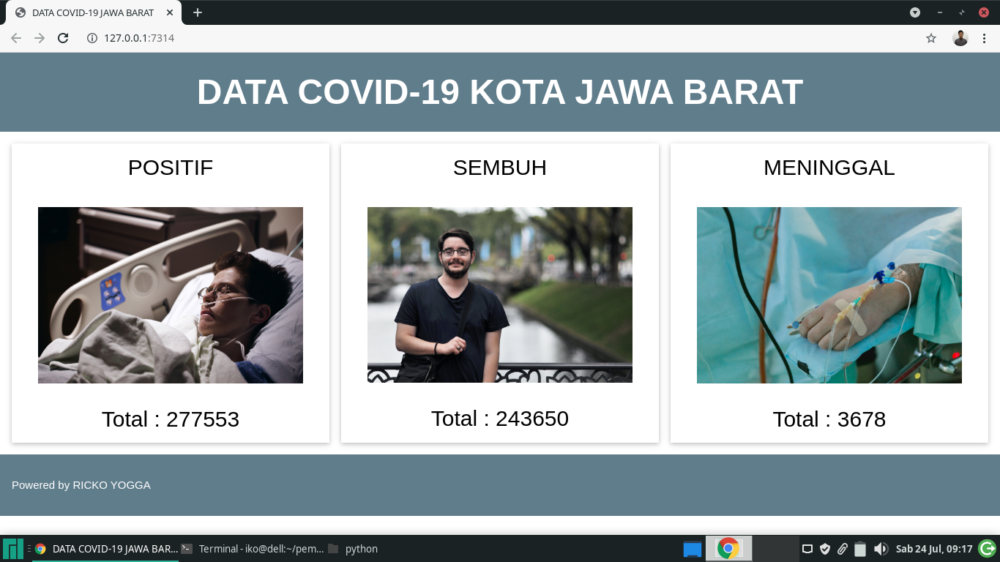

a simple website to view data on positive cases, recovering and dying from COVID-19 in the West Java area, by retrieving data from the kawalcorona.com website using requests.

to run it you have to install the package in requirements.txt by typing "pip install -r requirements.txt" in the terminal, then run it with the command "flask run"

Source: <a href="https://github.com/ikonicity/covidjabar"><i class="large github icon"></i>covidjabar</a>

