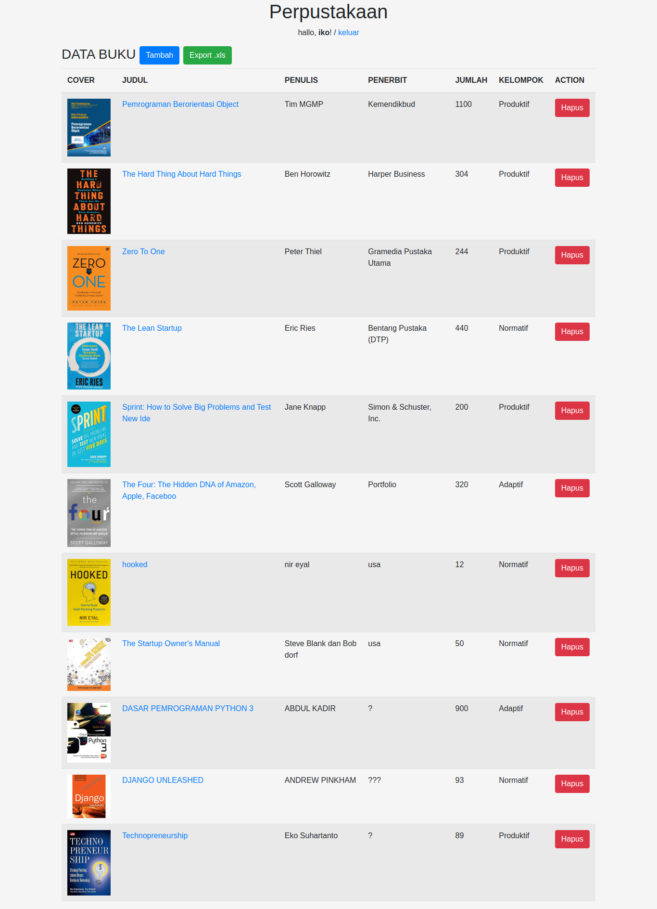

perpus is a website that I made as a portfolio, where the website I made with the Django framework, where I created a CRUD system (create, read, update and delete).
I also made an administration system where users who can do crud must be registered first

Source: <a href="https://github.com/ricko1993/django-perpus"><i class="large github icon "></i>django-perpus</a>

